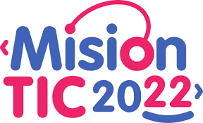

# Ciclo Java - MisionTic2022

[Ir al sitio web del programa Mision Tic 2022](https://www.misiontic2022.gov.co/portal/)

El ciclo No. 2 enfocado en programacion orientado por objetos en lenguaje Java
durante su desarrollo se asignaron cinco Retos de contrucción de programas
todos ellos constan de sus respectivas clases test, interfaz y mundo.

## 1 - Fundamentos de programación

1. Contenidos Semana1: “Hacia el desarrollo de Software o introducción a la programación orientada a objetos” 

- Solución global de problemas. Esto procedimiento incluye etapas de levantamiento de requerimientos funcionales y no funcionales, servicios a implementar, modelado de las clases, construcción de la solución.
- Estructura de un programa de computadora, rol que juegan sus elementos constitucionales. 
- Solución parcial de problemas, completar el programa, usando expresiones simples, asignaciones e invocaciones a métodos. Esto implica entender el concepto de parámetro y de creación de objetos. 
- Uso del ambiente de desarrollo Eclipse como espacio de trabajo predefinido, para completar una solución parcial a un problema.
- Modelar las características de un objeto, uso de estructuras de datos definición de constantes para representar los valores posibles de un atributo. - Uso de expresiones para identificar situaciónes posibles de estado de un objeto y para indicar la manera de modificar dicho estado. 
- Aplicación de instrucciones condicionales simples y compuestas como parte del cuerpo de un método. 
- Identificar de manera informal los métodos de una clase, utilizando para esto la técnica de agrupar los métodos por tipo de responsabilidad que tienen: construir, modificar o calcular.

2. Contenidos Semana2: "Introducción a SQL"

- Diseñar, crear y eliminar una Base de Datos relacional simple. 
- Consultas de SQL desde el lenguaje de programación Java a través del JDBC. 
- Sintaxis de manipulación de datos (SELECT, UPDATE, INSERT, DELETE). 
- Consultas de Filtrado, campos calculados, funciones del sistema, resumen y agrupamientos de datos y subconsultas. 
- Unión de tablas y consultas combinadas. 
- Sintaxis de escritura de consultas de definición de datos (CREATE, ALTER, DROP, TRUNCATE).

3. Contenidos Semana3: "Sobre tecnologías orientadas a objetos y el método UML "

- Introducción al Lenguaje Unificado de Modelado (UML). 
- Análisis de requerimientos usando modelamiento por casos de uso. 
- Del análisis al diseño (caracterización): Diagramas de Interacción/Secuencia. 
- Modelos dinámicos: Diagrama de estados / Diagrama de actividades. 
- Diagramas estructurales (clases, componentes, paquetes, objetos y despliegue).

4. Contenidos Semana4: "Validación y reutilización."

- Desarrollar clases y métodos necesarios para implementar las pruebas unitarias automáticas. 
- Entender la importancia de construir programas correctos y la manera como los invariantes, los contratos de los métodos y las pruebas unitarias son fundamentales en este propósito.
- Desacoplar las clases que hacen parte de un programa y utilizar interfaces para independizar los contratos funcionales de las implementaciones concretas.
- Importancia de la herencia como mecanismo de reutilización, con el cual es posible construir nuevas clases a partir de clases ya existentes, que comparten elementos en común. 
- Utilizar la herencia como mecanismo de construcción de aplicaciones en Java y entender el papel que juega la clase Object en dicho lenguaje. 
- Herencia en construcción de interfaces de usuario y tipos de excepciones. 
- Construir un programa que almacene su información persistente en una base de datos elemental.

5. Contenidos Semana5: "Modelo Vista Controlador e introducción a la programación Web "

- Estilos arquitectónicos/Patrones de diseño/ 
- Modelo Vista Controlador 
- Modelo Vista Presentador 
- Arquitectura JEE 
- Entender el papel que juega un programa servidor, al cual múltiples programas ejecutados por distintos usuarios se conectan para solicitar servicios.
- Integrar toda la teoría vista y las habilidades desarrolladas en los niveles anteriores, para resolver un problema más complejo, incluyendo requerimientos no funcionales de persistencia, distribución o concurrencia.